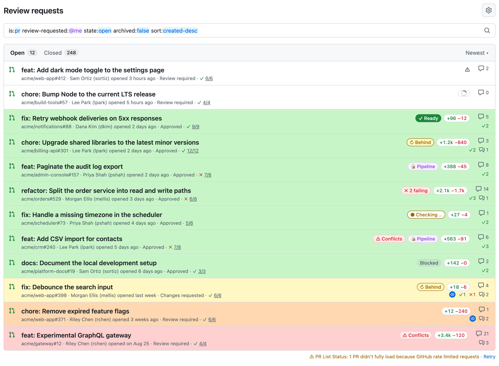
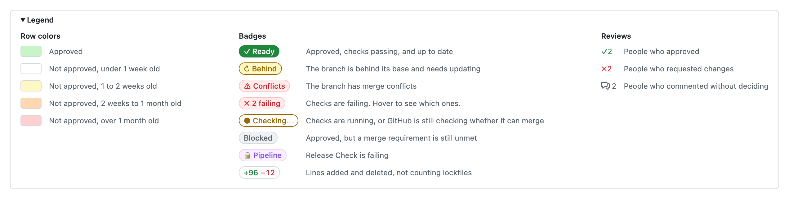

# GitHub PR List Status

A userscript that customizes GitHub's pull request list to show more detail at a glance.



*Sample data. [See the live demo](https://aseniah.github.io/github-pr-list-status/demo.html), rendered with the script's styles in light and dark mode.*

## Features

Works on GitHub's global pull request list at `github.com/pulls` (Authored by me, Review requests, Assigned to me, and any search) and on each repository's Pull requests tab.

- **Merge state at a glance.** Badges show what stands between each PR and merging, so you can tell which approved PRs are actually ready. A PR can show several at once, for example both Conflicts and Pipeline.
- **Diff size.** A `+177 −80` badge shows lines added and deleted. Lockfiles are left out by default so dependency upgrades show the size you'd actually review. Hover for exact numbers and how many lockfile lines were skipped.
- **Who has weighed in.** Under GitHub's comment count, `✓2` counts approvals, `✗1` counts change requests, and a discussion icon counts people who commented without deciding, such as someone asking a question. Hover for names. Pending reviewers who haven't interacted, the PR author, and bots aren't counted.
- **Row colors by age and approval.** Approved PRs are green. Unapproved PRs turn yellow after a week, orange after two weeks, and red after a month.
- **Live while checks run.** PRs showing **● Checking…** refresh themselves once a minute until their checks finish or GitHub settles their merge state.
- **Deploy gates.** A failing check you name, such as a release lock, gets its own badge instead of counting as a failure. See [Configuration](#configuration).
- **Built-in legend.** A collapsible legend at the bottom of the list explains each row color, badge, and review count.
- **Light and dark mode.** Colors come from GitHub's own theme.
- **No token or setup.** It uses your existing GitHub login and only ever shows PRs you already have access to.

| Badge | Meaning |
|---|---|
| ✓ Ready | Approved, checks passing, and up to date |
| ↻ Behind | The branch is behind its base and needs updating |
| ⚠ Conflicts | The branch has merge conflicts |
| ✗ 2 failing | Checks are failing. Hover to see which ones. |
| ● Checking… | Checks are running, or GitHub is still checking whether it can merge |
| Blocked | Approved, but a merge requirement is still unmet |
| 🔒 Pipeline | A deploy gate check is failing (see [Configuration](#configuration)) |

The same key is available on the page itself. Expand **Legend** below the list to see it.



## How it works

The list page doesn't include these details, so the script fetches them from the same endpoints GitHub's own pull request page uses. Requests go to `github.com` with your existing login.

Badges load once when the list appears, and reloading the page fetches fresh data. Results are cached for a minute per browser tab so moving between lists doesn't refetch everything, and at most four PRs load at a time. The one exception is **● Checking…**: while the tab is visible, those PRs refetch once a minute until their checks finish or GitHub settles their merge state.

These endpoints are undocumented and can change without notice. If a request fails, that row's badges are simply left off and the rest of the page works normally.

## Installation

You need a userscript manager extension. Once one is installed, open the install link and the extension will offer to install the script:

**[github-pr-list-status.user.js](https://raw.githubusercontent.com/aseniah/github-pr-list-status/main/github-pr-list-status.user.js)**

### Safari (macOS and iOS)

1. Install [Userscripts](https://apps.apple.com/app/userscripts/id1463298887) from the App Store.
2. In Safari, open **Settings → Extensions**, enable Userscripts, and allow it on `github.com`.
3. Open the install link above, click the Userscripts icon in the toolbar, and choose **Install**.

You can also download the `.user.js` file and save it into the folder Userscripts is set to use.

### Chrome, Edge, Brave, Arc, and other Chromium browsers

1. Install [Violentmonkey](https://violentmonkey.github.io/) or [Tampermonkey](https://www.tampermonkey.net/) from your browser's extension store.
2. Recent versions of Chrome require userscripts to be allowed explicitly. Open `chrome://extensions`, click **Details** on the extension, and turn on **Allow User Scripts**. On older versions, turn on **Developer mode** at the top right of the same page instead.
3. Open the install link above and confirm the install.

### Firefox

1. Install [Violentmonkey](https://addons.mozilla.org/firefox/addon/violentmonkey/), [Tampermonkey](https://addons.mozilla.org/firefox/addon/tampermonkey/), or [Greasemonkey](https://addons.mozilla.org/firefox/addon/greasemonkey/) from Firefox Add-ons.
2. Open the install link above and confirm the install.

### Other browsers

Any browser that runs a userscript manager should work. The script uses only standard browser APIs and no manager-specific functions. If your manager can't install from a link, create a new script and paste in the contents of `github-pr-list-status.user.js`.

## Updates

The script updates itself. Each release raises the `@version` in its header, and your userscript manager checks the install link above for a newer version and installs it.

| Manager | How updates arrive | How to turn them off |
|---|---|---|
| Userscripts (Safari) | Checked periodically. Updates are listed in the extension's popup, and you can also update from the script's editor. | Delete the `@updateURL` and `@downloadURL` lines from the script. |
| Tampermonkey | Checked automatically on a schedule. To check now, use **Check for userscript updates** in the extension's menu. | In the dashboard, open the script, go to its **Settings** tab, and uncheck **Check for updates**. |
| Violentmonkey | Checked automatically once a day. To check now, click the update icon next to the script in the dashboard. | In the dashboard, open the script's settings, turn off **Allow update**, and save. |
| Greasemonkey | Checked automatically. | Open the script from the Greasemonkey menu and set **Automatic Updates** to **Off**. |

In Tampermonkey, Violentmonkey, and Greasemonkey, deleting the header lines doesn't stop updates, because they fall back to the link you installed from. Use the setting instead.

## Configuration

All settings live in the `CONFIG` block at the top of the script. Edit them in your userscript manager's editor. An update replaces the whole file and your changes with it, so [turn off updates](#updates) for the script before editing, and keep a copy of your changes.

- `ageColors` and `approvedColor` set the row colors. Any CSS color works. The defaults are `var(--prb-row-green)` and similar, which switch between a light and a dark value along with GitHub's theme. The legend lists whatever thresholds and colors you set here, along with your `namedChecks` badges.
- `namedChecks` gives specific checks their own badge. When a failing check matches a rule, the PR shows that rule's badge instead of counting the check toward **✗ N failing**. `match` is an exact check name or a regular expression, and `style` is one of `purple`, `blue`, `red`, `yellow`, `gray`, or `green`. The default rule turns a failing `Release Check` into **🔒 Pipeline**. Replace it with your own deploy gate, or leave it alone if you don't have one.

```js
namedChecks: [
  { match: 'Release Check', label: '🔒 Pipeline', style: 'purple' },
  { match: /^deploy-freeze/i, label: '⏸ Frozen', style: 'blue' },
],
```

- `ignoredReviewers` leaves accounts out of the review counts. Each entry is an exact login or a regular expression. The defaults skip `[bot]` accounts and Copilot.
- `excludeLockfiles` leaves lockfiles out of the line counts and is on by default. `lockfilePattern` is the regular expression that decides what counts as a lockfile. It covers npm, Yarn, pnpm, Bun, Bundler, Cargo, Composer, Poetry, Pipenv, uv, Go, and Nix.
- `cacheMinutes` and `maxConcurrentPrs` control caching and how many PRs load at once.
- `checkingRefreshSeconds` sets how often PRs with running checks refetch while the tab is visible. Set it to `0` to turn this off.

## Limitations

- Generated files other than lockfiles, such as snapshots or compiled output, still count toward the line totals. Extend `lockfilePattern` to skip them.
- It relies on undocumented GitHub endpoints and page structure, so a GitHub update can break it until the script is fixed.

## License

[MIT](LICENSE)
